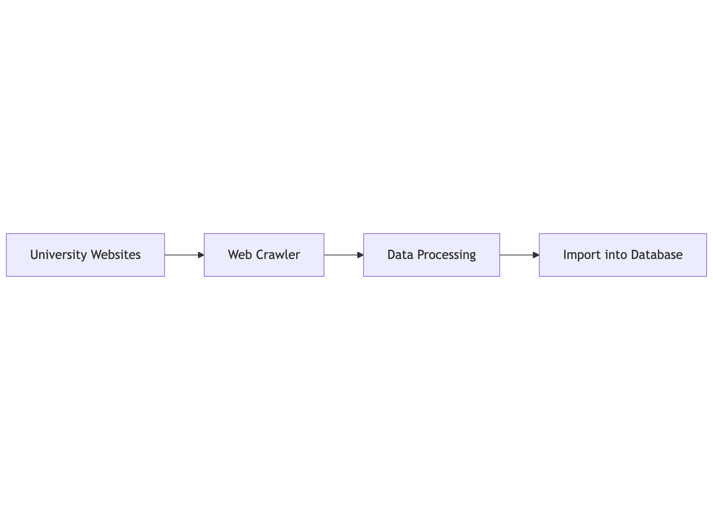

# IEA Data




## Data processing tools

This project is 'Data Processing' in overall IEA Data. It converts IEA profiles JSON files to 2 CSV for data import. CSV file strcture is related to data table:

```
CREATE TABLE public.academic_products (
    orcid VARCHAR(50) PRIMARY KEY,
    profiles JSONB DEFAULT '{}',
    introduction TEXT,
);

CREATE TABLE public.tags (
    id SERIAL PRIMARY KEY,
    orcid VARCHAR(50) NOT NULL REFERENCES public.academic_products(orcid) ON DELETE CASCADE,
    tag_id INTEGER NOT NULL,
    sub_id VARCHAR(10) NOT NULL
);
```

## How to use it

1. prepare env

    $ pyenv local 3.11.9

2. raw data 

    download json files to ./tag_data

3. exec

    $ cd scripts; sh run.sh

## Core steps

1. extract

    extract n item from each ./tag_data/*.json
    
2. clean 
    
    - standardize all the json to one structure
    - remove `\n` 
    - use eamil as orcid if orcid is null

3. convert tag to id 

    read index to map, then convert the text to id

4. export CSV for PostgreSQL insertion

    refer to table strcture of academic_products and tags, convert the taged json to csv.
